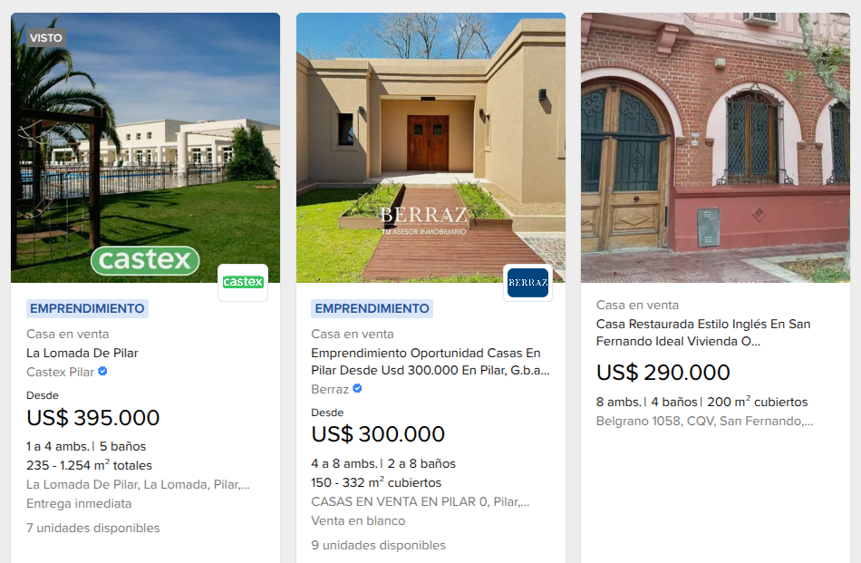
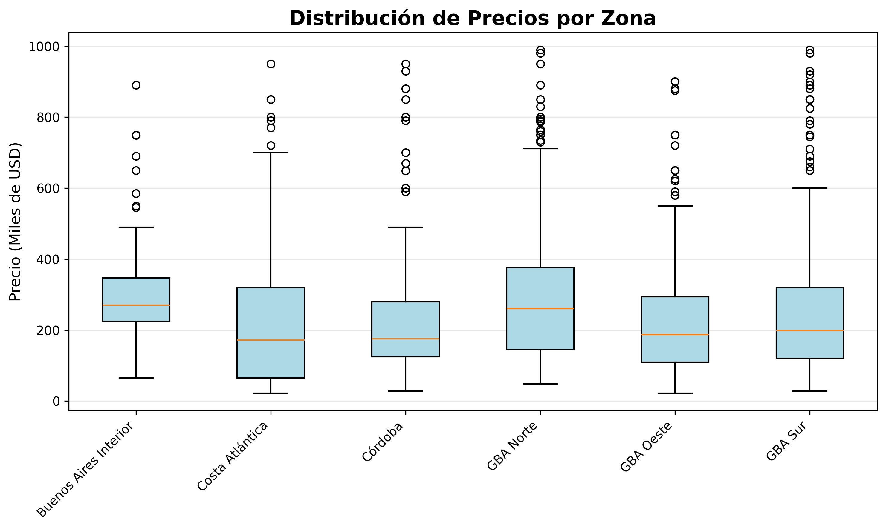

# Argentine Real Estate Market Analysis

## Description

Web scraper and analysis of properties for sale on MercadoLibre Argentina. The project extracts information from ~1900 properties across multiple zones, processes the data, and generates visualizations for real estate market analysis.



---

## Features

- **Web Scraping**: Automatic property extraction from MercadoLibre
- **Data Cleaning**: Processing and normalization of information
- **Statistical Analysis**: Interactive menu with multiple analyses
- **Visualizations**: 4 professional charts with Matplotlib

---

## Extracted Data

The scraper generates a CSV file with the following structure:

| zone      | city    | price  | rooms | bathrooms | area |
| --------- | ------- | ------ | ----- | --------- | ---- |
| GBA Norte | pilar   | 80000  | 9     | 6         | 400  |
| GBA Norte | pilar   | 180000 | 6     | 2         | 116  |
| Córdoba   | cordoba | 120000 | 4     | 2         | 175  |

**Columns:**

- `zone`: Geographic zone (GBA Norte, CABA, Córdoba, etc.)
- `city`: Specific city
- `price`: Price in USD
- `rooms`: Number of rooms
- `bathrooms`: Number of bathrooms
- `area`: Area in m²

---

## Generated Visualizations

The project generates 4 analysis charts:

1. **Average Price by Zone** (Bar chart)
   

2. **Price Distribution** (Histogram)
   

3. **Price vs Area Relationship** (Scatter plot)
   

4. **Price Distribution by Zone** (Box plot)
   

---

## Project Structure

```
ml-inmuebles/
├── scraper/
│   ├── config.py              # URLs and configuration
│   ├── scraper_ml.py          # Main web scraper
│   ├── processing.py          # Data cleaning
│   ├── analysis.py            # Statistical analysis
│   └── visualizations.py      # Chart generation
├── plots/                     # Generated charts
│   ├── precio_por_zona.png
│   ├── distribucion_precios.png
│   ├── precio_vs_area.png
│   └── boxplot_zonas.png
├── propiedades_limpias.csv    # Processed data
├── requirements.txt
└── README.md
```

---

## Technologies Used

- **Python 3.x**
- **BeautifulSoup4** - HTML Parsing
- **Requests** - HTTP Requests
- **Pandas** - Data manipulation and analysis
- **Matplotlib** - Visualizations

---

## Installation and Execution

### Prerequisites

- Python 3.8 or higher
- pip (Python package manager)

### Steps to run

1. **Clone the repository**

```bash
git clone https://github.com/tachyon-lhc/Scraper_ML-Inmuebles
cd  ml-inmuebles
```

1. **Create virtual environment** (recommended)

```bash
# Windows
python -m venv venv
venv\Scripts\activate

# Linux/Mac
python3 -m venv venv
source venv/bin/activate
```

1. **Install dependencies**

```bash
pip install -r requirements.txt
```

1. **Run the scraper**

```bash
python scraper/scraper_ml.py
```

1. **Process and clean data**

```bash
python scraper/processing.py
```

1. **Interactive analysis**

```bash
python scraper/analysis.py
```

1. **Generate visualizations**

```bash
python scraper/visualizations.py
```

---

## Results

- **Properties analyzed**: ~1900
- **Zones covered**: 6 (GBA Norte, GBA Sur, GBA Oeste, Buenos Aires Interior, Córdoba, Costa Atlántica)
- **Price range**: USD 22,000 - USD 990,000
- **Generated files**:
  - `propiedades_limpias.csv`
  - 4 visualizations in `plots/` folder

---

## Configuration

To modify the URLs or zones to scrape, edit `scraper/config.py`:

```python
URLS = {
    "GBA Norte": ["https://..."],
    # Add more zones as needed
}
```

---

## Contributions

Contributions are welcome. Please open an issue first to discuss proposed changes.

---
