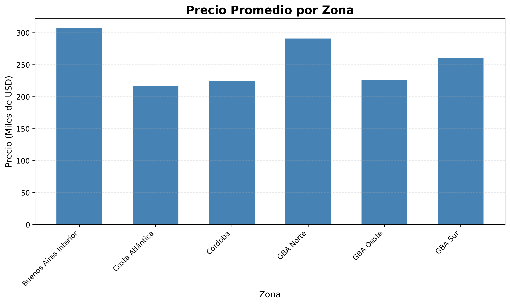
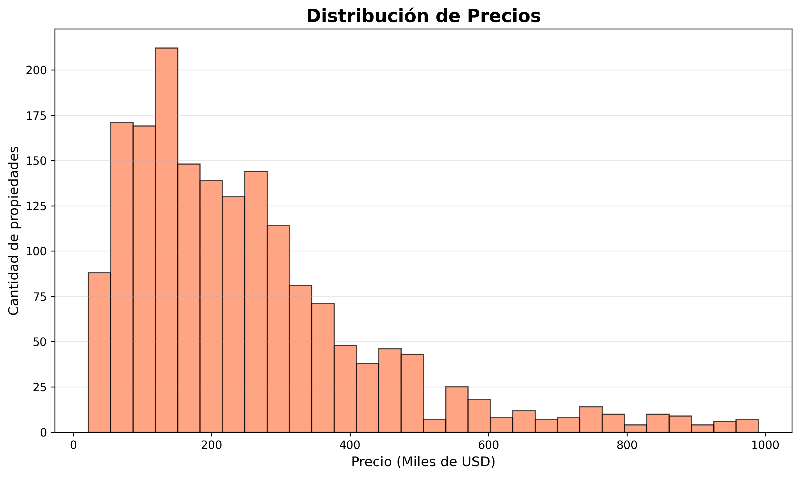
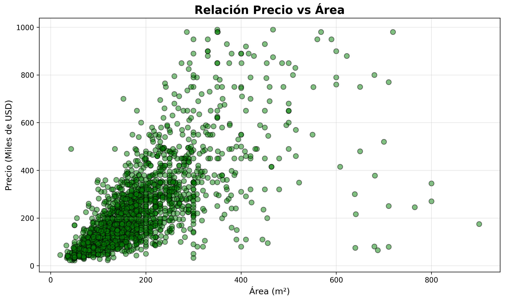

# Análisis del Mercado Inmobiliario Argentino

## Descripción

Web scraper y análisis de propiedades en venta en MercadoLibre Argentina. El proyecto extrae información de ~1900 propiedades de múltiples zonas, procesa los datos y genera visualizaciones para análisis del mercado inmobiliario.



---

## Características

- **Web Scraping**: Extracción automática de propiedades desde MercadoLibre
- **Limpieza de datos**: Procesamiento y normalización de información
- **Análisis estadístico**: Menú interactivo con múltiples análisis
- **Visualizaciones**: 4 gráficos profesionales con Matplotlib

---

## Datos extraídos

El scraper genera un archivo CSV con la siguiente estructura:

| zone      | city    | price  | rooms | bathrooms | area |
| --------- | ------- | ------ | ----- | --------- | ---- |
| GBA Norte | pilar   | 80000  | 9     | 6         | 400  |
| GBA Norte | pilar   | 180000 | 6     | 2         | 116  |
| Córdoba   | cordoba | 120000 | 4     | 2         | 175  |

**Columnas:**

- `zone`: Zona geográfica (GBA Norte, CABA, Córdoba, etc.)
- `city`: Ciudad específica
- `price`: Precio en USD
- `rooms`: Cantidad de habitaciones
- `bathrooms`: Cantidad de baños
- `area`: Superficie en m²

---

## Visualizaciones generadas

El proyecto genera 4 gráficos de análisis:

1. **Precio promedio por zona** (Gráfico de barras)
2. **Distribución de precios** (Histograma)
3. **Relación Precio vs Área** (Scatter plot)
4. **Distribución de precios por zona** (Box plot)




---

## Estructura del proyecto

```
ml-inmuebles/
├── scraper/
│   ├── config.py              # URLs y configuración
│   ├── scraper_ml.py          # Web scraper principal
│   ├── processing.py          # Limpieza de datos
│   ├── analysis.py            # Análisis estadístico
│   └── visualizations.py      # Generación de gráficos
├── plots/                     # Gráficos generados
│   ├── precio_por_zona.png
│   ├── distribucion_precios.png
│   ├── precio_vs_area.png
│   └── boxplot_zonas.png
├── propiedades_limpias.csv    # Datos procesados
├── requirements.txt
└── README.md
```

---

## Tecnologías utilizadas

- **Python 3.x**
- **BeautifulSoup4** - Parsing HTML
- **Requests** - Peticiones HTTP
- **Pandas** - Manipulación y análisis de datos
- **Matplotlib** - Visualizaciones

---

## Instalación y Ejecución

### Requisitos previos

- Python 3.8 o superior
- pip (gestor de paquetes de Python)

### Pasos para ejecutar

1. **Clonar el repositorio**

```bash
git clone https://github.com/TU-USUARIO/NOMBRE-REPO.git
cd NOMBRE-REPO
```

1. **Crear entorno virtual** (recomendado)

```bash
# Windows
python -m venv venv
venv\Scripts\activate

# Linux/Mac
python3 -m venv venv
source venv/bin/activate
```

1. **Instalar dependencias**

```bash
pip install -r requirements.txt
```

1. **Ejecutar el scraper**

```bash
python scraper/scraper_ml.py
```

1. **Procesar y limpiar datos**

```bash
python scraper/processing.py
```

1. **Análisis interactivo**

```bash
python scraper/analysis.py
```

1. **Generar visualizaciones**

```bash
python scraper/visualizations.py
```

---

## Resultados

- **Propiedades analizadas**: ~1900
- **Zonas cubiertas**: 6 (GBA Norte, GBA Sur, GBA Oeste, Buenos Aires Interior, Córdoba, Costa Atlántica)
- **Rango de precios**: USD 22,000 - USD 990,000
- **Archivos generados**:
  - `propiedades_limpias.csv`
  - 4 visualizaciones en carpeta `plots/`

---

## Configuración

Para modificar las URLs o zonas a scrapear, editá `scraper/config.py`:

```python
URLS = {
    "GBA Norte": ["https://..."],
    # Agregar más zonas según necesidad
}
```

---

## Contribuciones

Las contribuciones son bienvenidas. Por favor, abrí un issue primero para discutir los cambios propuestos.

---
